

    <h1 style="text-align: center;">Live On <a href="https://news.mydotnetprojects.ir">click</a></h1>
    <h1 style="text-align: center;">قابلیت ها و امکانات وبسایت خبری و پنل مدیریت</h1>
    <h4>ویژگی ها</h4>
    <ol>
            <li>پیاده سازی ورود به سایت و عضویت  (پیاده سازی شده با Ajax)</li>
            <li>نمایش پربازدیدترین اخبار روز ، هفته و ماه (پیاده سازی شده با Ajax)</li>
            <li>نمایش پربحث ترین اخبار روز ، هفته و ماه (پیاده سازی شده با Ajax)</li>
            <li>نمایش محبوب ترین اخبار</li>
            <li>نمایش همه اخبار به صورت صفحه بندی شده</li>
            <li>عضویت کاربر در خبرنامه</li>
            <li>نمایش اسلایدشو جدیدترین اخبار</li>
            <li>نمایش اسلایدشوی جدیدترین اخبار داخلی و خارجی</li>
            <li>نمایش اسلایدشو جدیدترین ویدیوها</li>
            <li>نمایش اخبار و ویدیوهای تصادفی در فوتر سایت</li>
            <li>نمایش تیتر جدیدترین اخبار در هدر سایت</li>
        </ol>
    
    <h4>ویژگی ها</h4>
    <ol>
            <li>امکان رفتن به خبر قبلی و بعدی</li>
            <li>نمایش جزئیات خبر</li>
            <li>نمایش برچسب های خبر</li>
            <li>نمایش اطلاعات نویسنده خبر</li>
            <li>نمایش نظرات خبر به صورت آبشاری</li>
            <li>امکان ارسال نظر و پاسخ به نظرات</li>
            <li>بوکمارک کردن خبر توسط کاربران عضو سایت</li>
            <li>لایک و دیس لایک کردن خبر</li>
        </ol>
    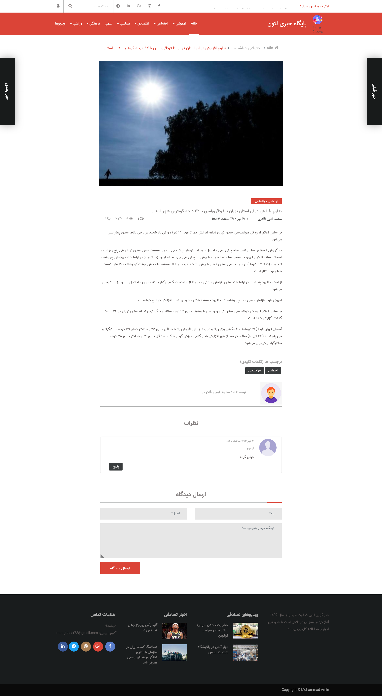
    <h4>امکانات پنل مدیریت</h4>
    <ul>
        <li>تعریف کاربر با نقش های مختلف و سطح دسترسی های مختلف</li>
        <li>مدیریت کاربران شامل ویرایش اطلاعات آنها ، ریست پسورد و حذف کاربران</li>
        <li>ارسال یک خبر جدید </li>
        <li>قابلیت قرار دادن تصویر شاخص برای خبر و برش تصویر در اندازه دلخواه</li>
        <li>قابلیت اضافه کردن برچسب برای خبر</li>
        <li>قابلیت انتخاب چندین دسته برای خبر</li>
        <li>نوشتن متن خبر در ادیتور حرفه ای TinyMce</li>
        <li>نوشتن عنوان و چکیده خبر</li>
        <li>قابلیت انتشار خبر در آینده و پیش نویس کردن خبر</li>
        <li>مدیریت اخبار شامل حذف هر خبر به صورت جداگانه ، جستجو و مرتب سازی اخبار و ویرایش اخبار</li>
        <li>افزودن دسته بندی جدید برای اخبار</li>
        <li>مدیریت دسته بندی های اخبار شامل حذف و ویرایش دسته ها</li>
        <li>مدیریت دیدگاه های اخبار</li>
        <li>مدیریت برچسب های اخبار</li>
        <li>قابلیت حذف، تائید و عدم تائید دیدگاه های ارسالی</li>
        <li>امکان ویرایش اطلاعات بخش نمایه من</li>
        <li>امکان تغییر کلمه عبور</li>
    </ul>
     <h3 style="text-align: center;">مدیریت اخبار</h3>
     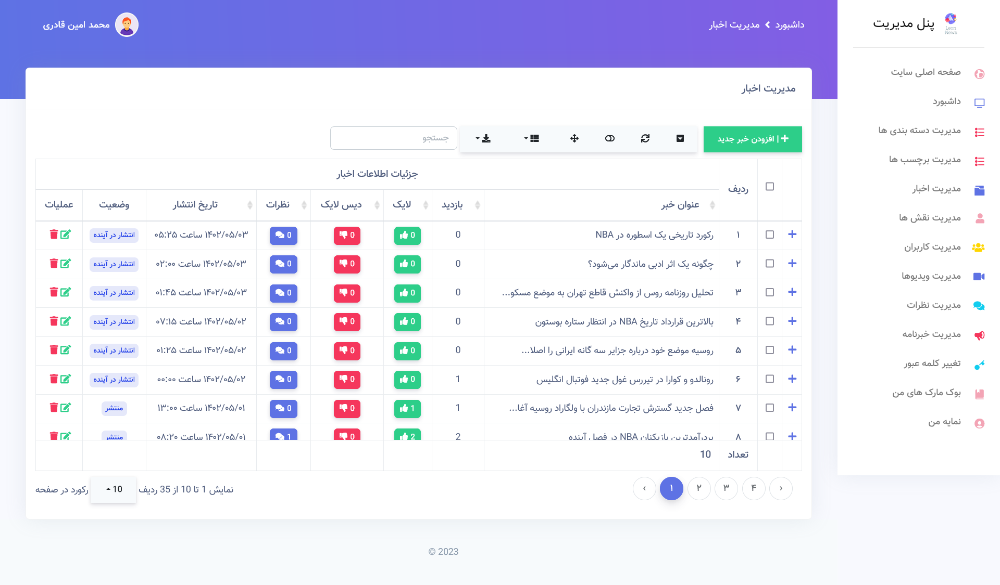
     <h3 style="text-align: center;">مدیریت برچسب ها</h3>
     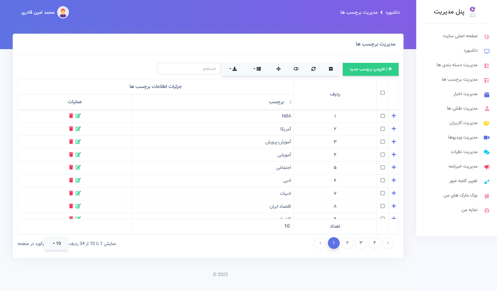
      <h3 style="text-align: center;">مدیریت دسته بندی ها</h3>
     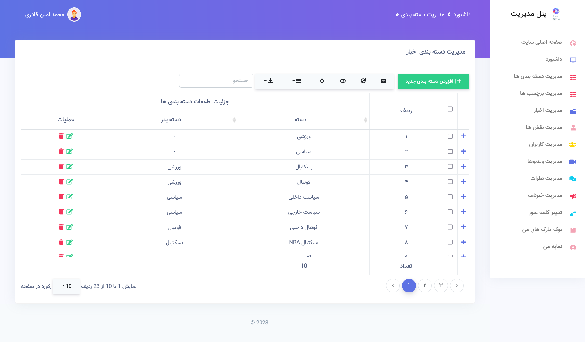
     <h3 style="text-align: center;">مدیریت نظر ها</h3>
     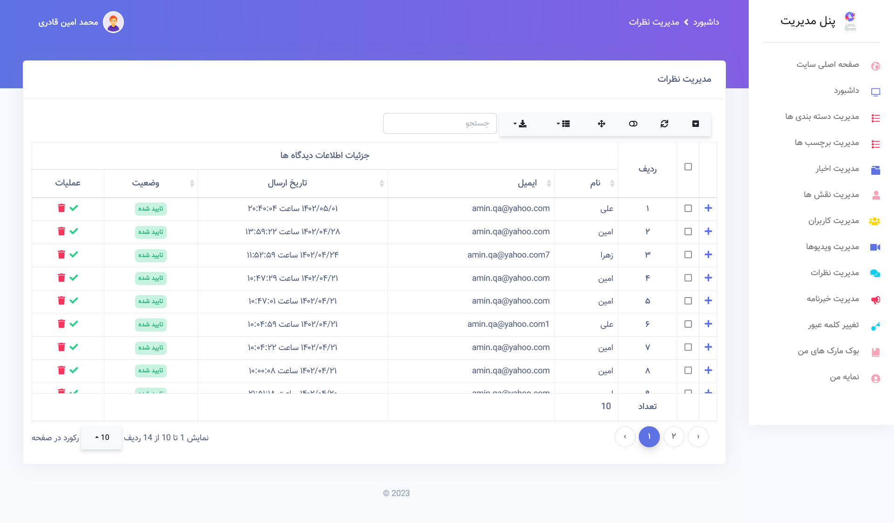
     <h3 style="text-align: center;">مدیریت ویدیو ها</h3>
     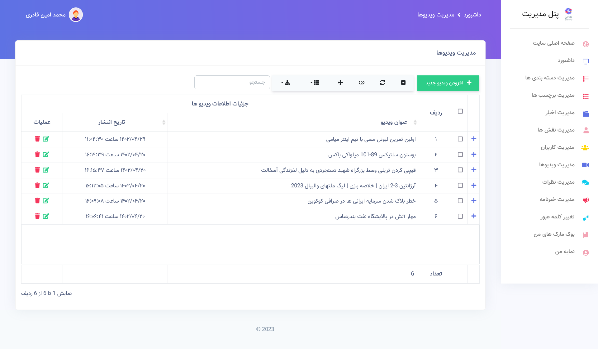
     <h3 style="text-align: center;"> نمای من </h3>
     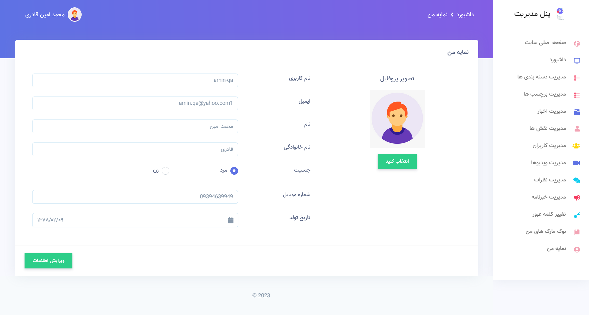
     <h3 style="text-align: center;"> داشبورد مدیریت</h3>
     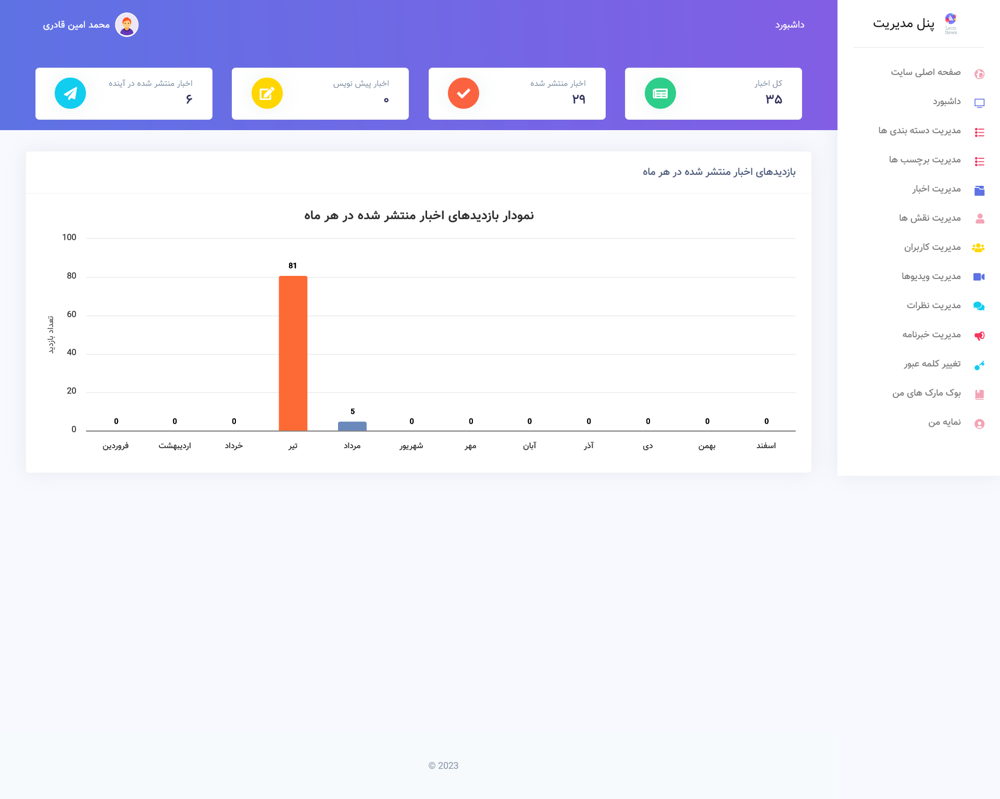
     <h3 style="text-align: center;">  مدیریت کاربر</h3>
     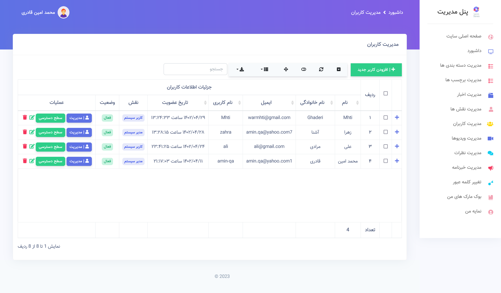
      <h3 style="text-align: center;">  مدیریت کاربر</h3>
     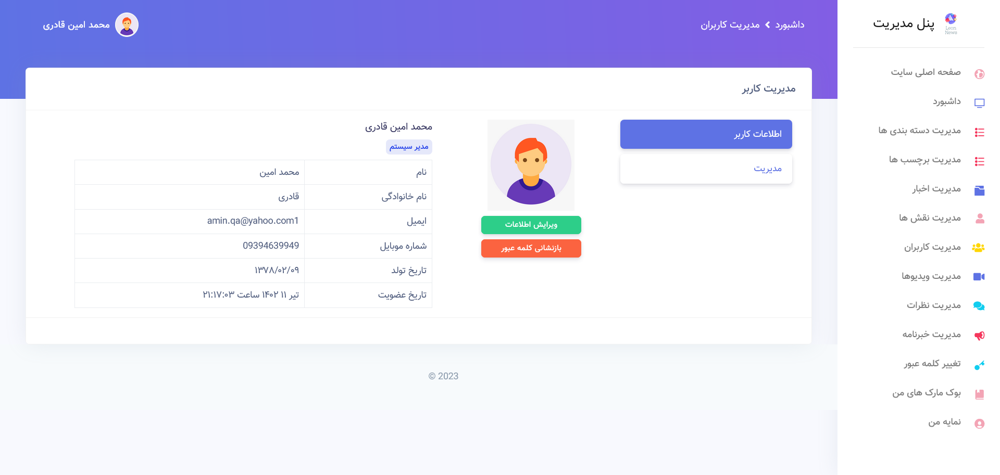
      <h3 style="text-align: center;">  مدیریت کاربر</h3>
     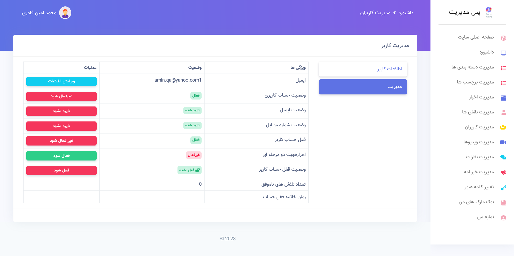
      <h3 style="text-align: center;">سطح دست رسی پویا برای هر کاربر</h3>
     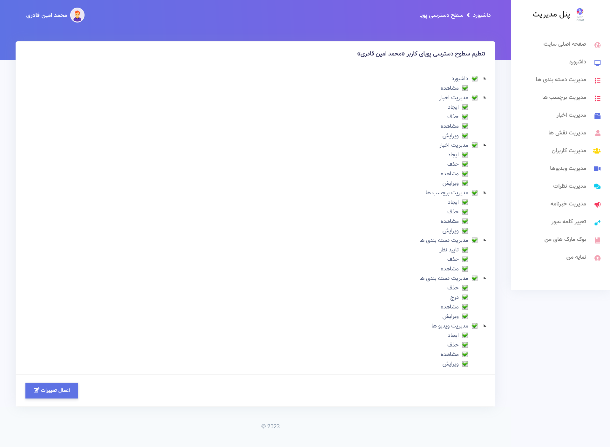

